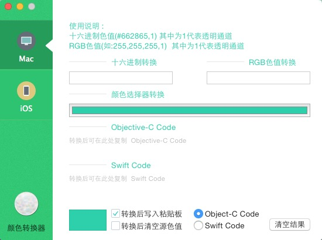

# ColorCalculater

ColorCalculater 是个人休闲时间完成一个 Color Value Paint to Object-c/swift 的小工具.

---
* 支持 RGB 色值 Hex 色值转换程Object-c/swift
* 支持转换 OSX 和 iOS Object-c/swift
* 支持转换后自动写入粘贴板
---

##如果有问题, 欢迎指出 XDD

